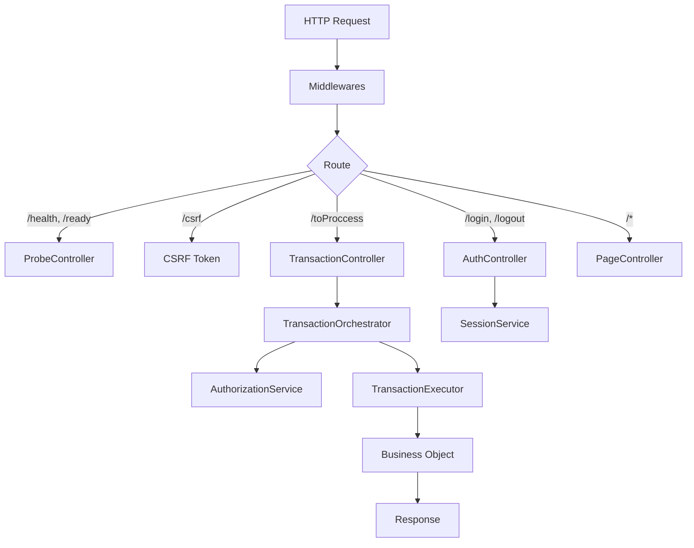

# AppServer Core: The HTTP Entry Point

The `AppServer` (formerly Dispatcher) is the main entry point. It initializes Express and connects Controllers.

## Architecture



## Responsibilities

### 1. AppServer (`AppServer.ts`)

- **Bootstrap**: Configures Express, Helmet, CORS, BodyParsers.
- **Routing**: Maps URLs to Controllers.
- **Lifecycle**: Handles `init()`, `serverOn()`, and `shutdown()`.
- **Injection**: Instantiates `TransactionOrchestrator` and injects it into the controller.

### 2. TransactionController (`TransactionController.ts`)

- **Orchestration**: Handles the master route `/toProccess`.
- **Logic**: Validates `tx` and delegates execution to `TransactionOrchestrator`.

### 3. AuthController (`AuthController.ts`)

- **Authentication**: Handles `/login` and `/logout`.
- **Logic**: Delegates to `SessionService` and manages HTTP responses.

### 4. ProbeController (`ProbeController.ts`)

- **Observability**: Handles `/health` and `/ready`.
- **Logic**: Checks uptime and service status.

### 5. PageController (`PageController.ts`)

- **Static Content**: Serves views from `public/pages`.
- **Routing**: Fallback for non-API routes.

## The Master Route: `/toProccess`

Managed by `TransactionController`.

```typescript
POST /toProccess
Content-Type: application/json
X-CSRF-Token: <token>

{
  "tx": 1001,
  "params": { ... }
}
```

### Internal Flow

```
┌─────────────────────────────────────────────────────────────────┐
│  1. Validate session → get profileId                            │
│  2. Validate body (tx: number, params: object)                  │
│  3. TransactionOrchestrator.execute()                           │
│     → Resolve Route (Mapper)                                    │
│     → Validate Regex (Security)                                 │
│     → AuthorizationService.check()                              │
│     → TransactionExecutor.execute()                             │
│       → Validate Path Containment                               │
│       → Instantiate BO                                          │
│       → Execute Method                                          │
│  4. Respond to client                                           │
└─────────────────────────────────────────────────────────────────┘
```

## Error Handling

The `createFinalErrorHandler` middleware centralizes handling:

1. **Marks** `res.locals.__errorLogged = true` to avoid duplicate logs.
2. **Logs** the error scrubbing secrets.
3. **Responds** with a generic error (no info leak).

```typescript
// Client receives
{ "code": 500, "msg": "Server error" }

// Log receives (server)
"[ERROR] Server error, /toProccess: Cannot read property 'x' of undefined"
// + stack trace + context (userId, profileId, tx, etc.)
```

## See Also

- [Bootstrap](./BOOTSTRAP.en.md) - System initialization
- [Security System](./SECURITY_SYSTEM.en.md) - Permissions and transactions
- [Transaction Flow](./TRANSACTION_FLOW.en.md) - Execution of business methods
