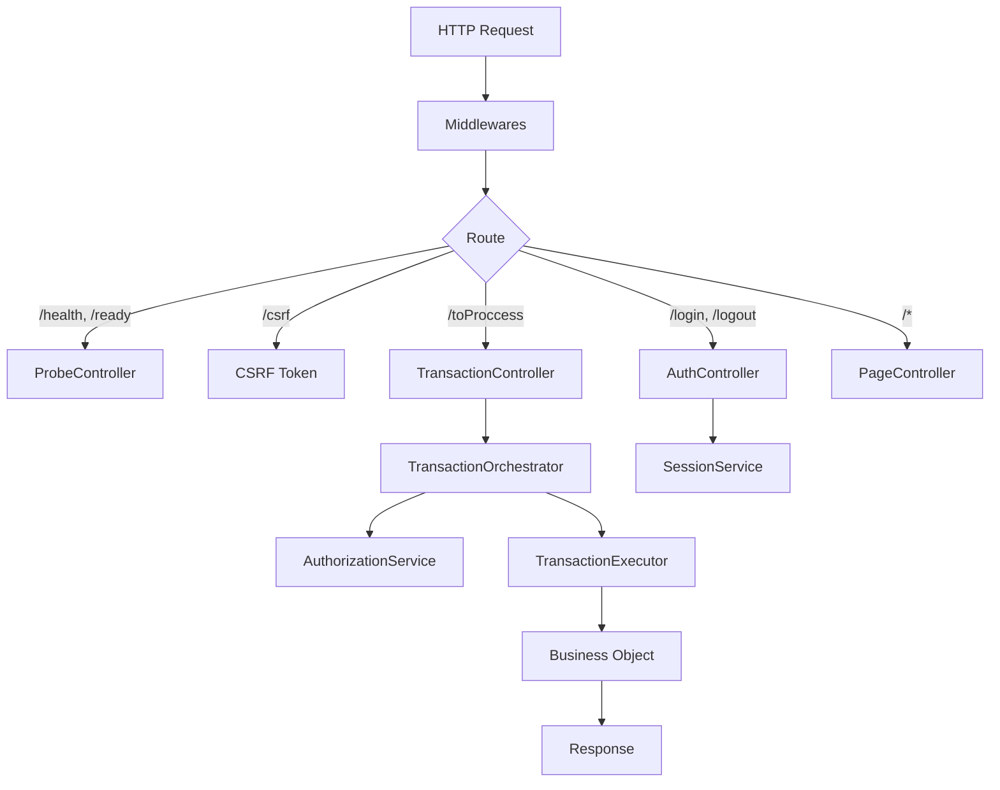

# AppServer Core: El Punto de Entrada HTTP

El `AppServer` (anteriormente Dispatcher) es el punto de entrada principal. Inicializa Express y conecta los Controladores.

## Arquitectura



## Responsabilidades

### 1. AppServer (`AppServer.ts`)

- **Bootstrap**: Configura Express, Helmet, CORS, BodyParsers.
- **Routing**: Mapea URLs a los Controladores.
- **Ciclo de Vida**: Maneja `init()`, `serverOn()` y `shutdown()`.
- **Inyección**: Instancia `TransactionOrchestrator` y lo inyecta al controller.

### 2. TransactionController (`TransactionController.ts`)

- **Orquestación**: Maneja la ruta maestra `/toProccess`.
- **Lógica**: Valida `tx` y delega la ejecución al `TransactionOrchestrator`.

### 3. AuthController (`AuthController.ts`)

- **Autenticación**: Maneja `/login` y `/logout`.
- **Lógica**: Delega a `SessionService` y gestiona respuestas HTTP.

### 4. ProbeController (`ProbeController.ts`)

- **Observabilidad**: Maneja `/health` y `/ready`.
- **Lógica**: Verifica uptime y estado de servicios.

### 5. PageController (`PageController.ts`)

- **Contenido Estático**: Sirve vistas desde `public/pages`.
- **Routing**: Fallback para rutas no API.

## La Ruta Maestra: `/toProccess`

Gestionada por `TransactionController`.

```typescript
POST /toProccess
Content-Type: application/json
X-CSRF-Token: <token>

{
  "tx": 1001,
  "params": { ... }
}
```

### Flujo Interno

```
┌─────────────────────────────────────────────────────────────────┐
│  1. Validar sesión → obtener profileId                          │
│  2. Validar body (tx: number, params: object)                   │
│  3. TransactionOrchestrator.execute()                           │
│     → Resolver Ruta (Mapper)                                    │
│     → Validar Regex (Security)                                  │
│     → AuthorizationService.check()                              │
│     → TransactionExecutor.execute()                             │
│       → Validar Path Containment                                │
│       → Instanciar BO                                           │
│       → Ejecutar Método                                         │
│  4. Responder al cliente                                        │
└─────────────────────────────────────────────────────────────────┘
```

## Manejo de Errores

El middleware `createFinalErrorHandler` centraliza el manejo:

1. **Marca** `res.locals.__errorLogged = true` para evitar logs duplicados.
2. **Loguea** el error redactando secretos.
3. **Responde** con un error genérico (sin fugar info sensible).

```typescript
// Cliente recibe
{ "code": 500, "msg": "Server error" }

// Log recibe (servidor)
"[ERROR] Server error, /toProccess: Cannot read property 'x' of undefined"
// + stack trace + contexto (userId, profileId, tx, etc.)
```

## Ver También

- [Bootstrap](./BOOTSTRAP.es.md) - Inicialización del sistema
- [Sistema de Seguridad](./SECURITY_SYSTEM.es.md) - Permisos y transacciones
- [Flujo de Transacción](./TRANSACTION_FLOW.es.md) - Ejecución de métodos de negocio
