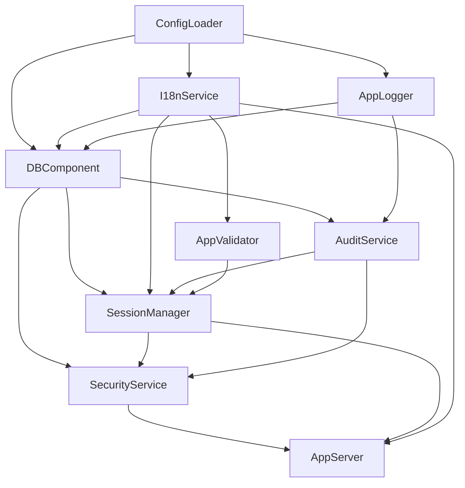

# Bootstrap Process

Technical documentation of the ToProccess application initialization flow.

## Entry Point

The `src/index.ts` file is the application entry point. Its responsibility is minimal:

```typescript
import { appServer, log, security } from './foundation.js'

await security.init()
await appServer.init()
appServer.serverOn()
```

## Initialization Order (`foundation.ts`)

The `src/foundation.ts` file orchestrates the ordered creation of all core services:

```
┌─────────────────────────────────────────────────────────┐
│  1. Configuration (ConfigLoader)                        │
│  2. Internationalization (I18nService)                  │
│  3. Feature Flags                                       │
│  4. Validator (AppValidator + Zod)                      │
│  5. Logger (AppLogger)                                  │
│  6. Database (DBComponent)                              │
│  7. Service Layer:                                      │
│     ├── AuditService                                    │
│     ├── EmailService                                    │
│     ├── SessionManager                                  │
│     └── SecurityService                                 │
│  8. AppServer (HTTP Server)                            │
└─────────────────────────────────────────────────────────┘
```

### Service Dependencies



## Container (Global Registry)

Although we use explicit injection, we maintain a `Container` for cases where dynamic dependency resolution is needed:

```typescript
import { container } from './core/Container.js'

// Registration
container.register('db', db)
container.register('log', appLogger)

// Resolution (internal use)
const db = container.resolve<IDatabase>('db')
```

> [!NOTE]
> The Container is primarily used for CLI scripts and testing compatibility.
> Business Objects receive dependencies via constructor (`BODependencies`).

## Shutdown Signals

The application gracefully handles `SIGINT` and `SIGTERM` signals:

1. Stops the HTTP server
2. Closes database connections
3. Releases resources
4. Exits with code 0 (success) or 1 (error)

## See Also

- [Dependency Injection](./DEPENDENCY_INJECTION.en.md) - How dependencies flow to Business Objects
- [AppServer Core](./APPSERVER_CORE.en.md) - HTTP server functionality
