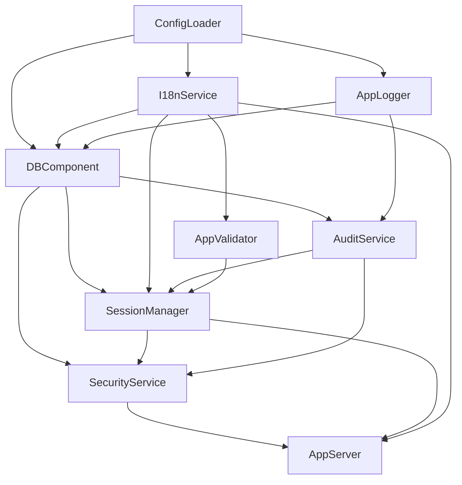

# Proceso de Arranque (Bootstrap)

Documentación técnica del flujo de inicialización de la aplicación ToProccess.

## Punto de Entrada

El archivo `src/index.ts` es el punto de entrada de la aplicación. Su responsabilidad es mínima:

```typescript
import { appServer, log, security } from './foundation.js'

await security.init()
await appServer.init()
appServer.serverOn()
```

## Orden de Inicialización (`foundation.ts`)

El archivo `src/foundation.ts` orquesta la creación ordenada de todos los servicios core:

```
┌─────────────────────────────────────────────────────────┐
│  1. Configuración (ConfigLoader)                        │
│  2. Internacionalización (I18nService)                  │
│  3. Feature Flags                                       │
│  4. Validador (AppValidator + Zod)                      │
│  5. Logger (AppLogger)                                  │
│  6. Base de Datos (DBComponent)                         │
│  7. Capa de Servicios:                                  │
│     ├── AuditService                                    │
│     ├── EmailService                                    │
│     ├── SessionManager                                  │
│     └── SecurityService                                 │
│  8. AppServer (Servidor HTTP)                         │
└─────────────────────────────────────────────────────────┘
```

### Dependencias entre Servicios



## Container (Registro Global)

Aunque usamos inyección explícita, mantenemos un `Container` para casos donde se necesita resolver dependencias dinámicamente:

```typescript
import { container } from './core/Container.js'

// Registro
container.register('db', db)
container.register('log', appLogger)

// Resolución (uso interno)
const db = container.resolve<IDatabase>('db')
```

> [!NOTE]
> El Container se usa principalmente para compatibilidad con scripts CLI y testing.
> Los Business Objects reciben dependencias via constructor (`BODependencies`).

## Señales de Cierre

La aplicación maneja gracefully las señales `SIGINT` y `SIGTERM`:

1. Detiene el servidor HTTP
2. Cierra conexiones de base de datos
3. Libera recursos
4. Sale con código 0 (éxito) o 1 (error)

## Ver También

- [Inyección de Dependencias](./DEPENDENCY_INJECTION.es.md) - Cómo fluyen las dependencias a los Business Objects
- [AppServer Core](./APPSERVER_CORE.es.md) - Funcionamiento del servidor HTTP
