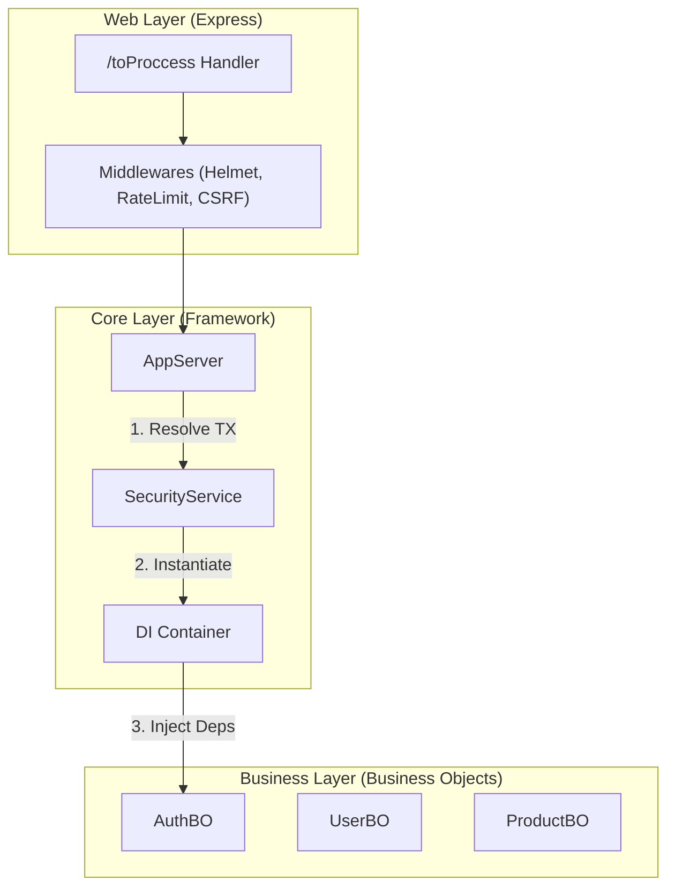

# Detailed Architecture (Overview)

To understand how ToProccess scales, we use the **C4** model (Context, Containers, Components, Code). Here we will dive deep into the Component level.

## Level 1: System Context

Where does our system live in the world?

```mermaid
graph TD
    User[End User] -->|HTTPS| CDN[CDN / Load Balancer (Cloudflare)]
    CDN -->|HTTPS| System[ToProccess API]
    System -->|TCP| DB[(PostgreSQL)]
    System -->|SMTP| Email[Email Provider (AWS SES/SendGrid)]

    classDef system fill:#1168bd,stroke:#0b4884,color:white;
    classDef external fill:#999,stroke:#666,color:white;
    class System system;
    class User,CDN,DB,Email external;
```

## Level 2: Containers (Our API)

Inside the "ToProccess API" box, here is what we have:

- **Technology**: Node.js v20+
- **Web Framework**: Express.js 5 (Minimalist)
- **Language**: Strict TypeScript

This API is a "modular monolith". Everything runs in a single Node process, but internally it's separated as if they were logical microservices.

## Level 3: Components (The Heart)

This is where our framework shines due to its modified Clean Architecture.



### Component Explanation

1.  **Web Layer**: It's dumb. It only knows HTTP (req, res, headers). Its only job is to deliver the JSON package to the AppServer.
2.  **AppServer**: The traffic director. Configures Express and routes transactions (`tx`) via Controllers.
3.  **SecurityService**: The armed guard. NO ONE executes anything unless this service gives the green light. Loads permissions from DB at startup.
4.  **Container**: The toolbox. Contains the live DB connection, configured logger, and audit service. Passed from hand to hand.
5.  **Business Objects**: Isolated modules. Receive the `Container` and execute logic.
