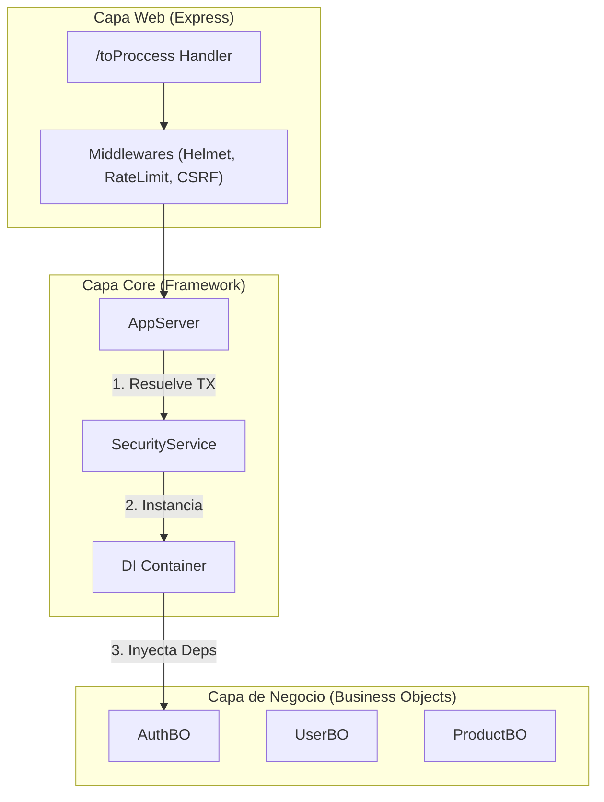

# Arquitectura Detallada (Architecture Overview)

Para entender cómo escala ToProccess, usamos el modelo **C4** (Context, Containers, Components, Code). Aquí vamos a profundizar hasta el nivel de Componentes.

## Nivel 1: Contexto del Sistema

¿Dónde vive nuestro sistema en el mundo?

```mermaid
graph TD
    User[Usuario Final] -->|HTTPS| CDN[CDN / Load Balancer (Cloudflare)]
    CDN -->|HTTPS| System[ToProccess API]
    System -->|TCP| DB[(PostgreSQL)]
    System -->|SMTP| Email[Email Provider (AWS SES/SendGrid)]

    classDef system fill:#1168bd,stroke:#0b4884,color:white;
    classDef external fill:#999,stroke:#666,color:white;
    class System system;
    class User,CDN,DB,Email external;
```

## Nivel 2: Contenedores (Nuestra API)

Dentro de la caja "ToProccess API", esto es lo que tenemos:

- **Tecnología**: Node.js v20+
- **Framework Web**: Express.js 5 (Minimalista)
- **Lenguaje**: TypeScript Estricto

Esta API es un "monolito modular". Todo corre en un solo proceso de Node, pero internamente está separado como si fueran microservicios lógicos.

## Nivel 3: Componentes (El Corazón)

Aquí es donde nuestro framework brilla por su Clean Architecture modificada.



### Explicación de Componentes

1.  **Capa Web**: Es tonta. Solo sabe de HTTP (req, res, headers). Su único trabajo es entregar el paquete JSON al AppServer.
2.  **AppServer**: El director de tráfico. Configura Express y enruta transacciones (`tx`) vía Controladores.
3.  **SecurityService**: El guardia armado. NADIE ejecuta nada si este servicio no da luz verde. Carga permisos desde la DB al inicio.
4.  **Container**: La caja de herramientas. Contiene la conexión viva a la DB, el logger configurado, y el servicio de auditoría. Se pasa de mano en mano.
5.  **Business Objects**: Módulos aislados. Reciben el `Container` y ejecutan la lógica.
