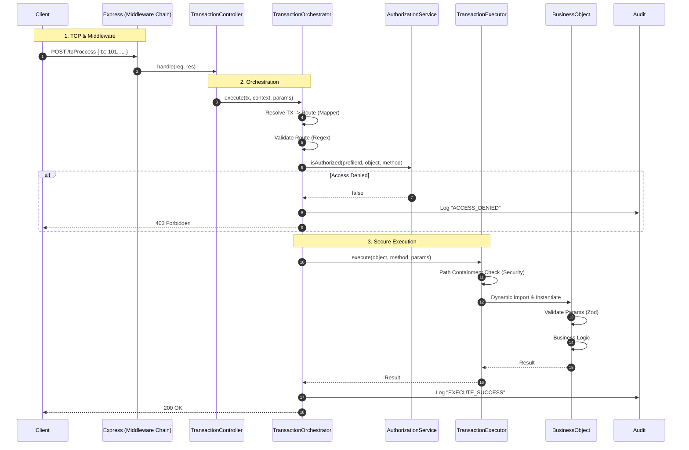

# The Request Journey (Transaction Flow)

Let's analyze microscopically what happens when you `POST /toProccess`.

## Complete Sequence Diagram

## Step-by-Step Analysis

### 1. Middlewares & Controller

As always: Helmet, RateLimit, CSRF. The `TransactionController` receives the request, extracts the session, and immediately delegates to `TransactionOrchestrator`.

### 2. TransactionOrchestrator (The Brain)

1.  **Resolution**: Converts `tx: 101` to `Auth.login`.
2.  **Route Validation**: Checks that `Auth` and `login` are secure names (alphanumeric), preventing command injection.
3.  **Authorization**: Asks `AuthorizationService` if the current user can execute that route.

### 3. AuthorizationService (The Law)

Consults the in-memory permission matrix (RAM). If it says NO, everything stops and a security alert is logged.

### 4. TransactionExecutor (The Muscle)

If everything is legal:

1.  **Path Security**: Verifies that the Business Object file is physically located within the allowed `BO/` folder. Blocks any attempt to escape the directory (`../`).
2.  **Instantiation**: Loads the BO and injects dependencies (`db`, `logger`, `validator`).
3.  **Execution**: Calls the requested method.

### 5. Audit

The orchestrator logs the final result (success or error) in the audit service, guaranteeing complete traceability.
