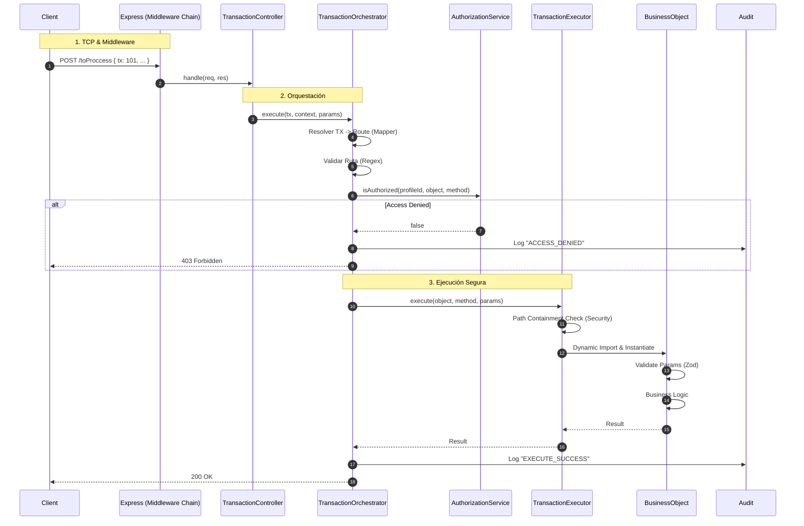

# El Viaje de una Petición (Transaction Flow)

Vamos a analizar microscópicamente qué pasa cuando haces `POST /toProccess`.

## Diagrama de Secuencia Completo

## Análisis Paso a Paso

### 1. Middlewares y Controller

Igual que siempre: Helmet, RateLimit, CSRF. El `TransactionController` recibe la petición, extrae la sesión y delega inmediatamente al `TransactionOrchestrator`.

### 2. TransactionOrchestrator (El Cerebro)

1.  **Resolución**: Convierte `tx: 101` en `Auth.login`.
2.  **Validación de Ruta**: Verifica que `Auth` y `login` sean nombres seguros (alfanuméricos), evitando inyección de comandos.
3.  **Autorización**: Pregunta al `AuthorizationService` si el usuario actual puede ejecutar esa ruta.

### 3. AuthorizationService (La Ley)

Consulta la matriz de permisos en memoria (RAM). Si dice NO, se detiene todo y se registra una alerta de seguridad.

### 4. TransactionExecutor (El Músculo)

Si todo es legal:

1.  **Path Security**: Verifica que el archivo del Business Object esté físicamente dentro de la carpeta `BO/` permitida. Bloquea cualquier intento de salir del directorio (`../`).
2.  **Instanciación**: Carga el BO e inyecta el contenedor (`IContainer`).
3.  **Ejecución**: Llama al método solicitado.

### 5. Auditoría

El orquestador registra el resultado final (éxito o error) en el servicio de auditoría, garantizando trazabilidad completa.
