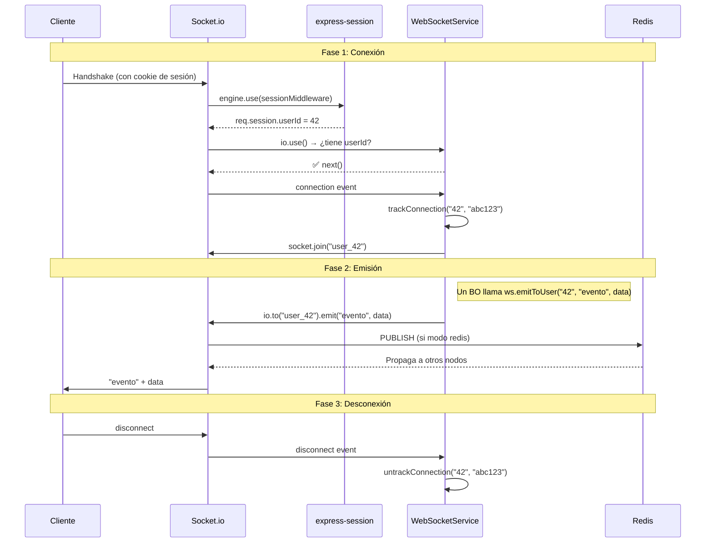

# WebSocketService — Guía Detallada Línea por Línea

> **Archivo:** `src/services/WebSocketService.ts`
> **Responsabilidad:** Gestionar conexiones WebSocket en tiempo real, emitir eventos a usuarios/salas, y escalar horizontalmente via Redis Pub/Sub.

---

## Tabla de Contenidos

1. [Imports y Dependencias](#1-imports-y-dependencias)
2. [Arquitectura Híbrida](#2-arquitectura-híbrida)
3. [Propiedades de la Clase](#3-propiedades-de-la-clase)
4. [Constructor](#4-constructor)
5. [initialize() — Punto de Entrada](#5-initialize--punto-de-entrada)
6. [Métodos Públicos de Emisión](#6-métodos-públicos-de-emisión)
7. [Gestión de Salas (Rooms)](#7-gestión-de-salas-rooms)
8. [Métricas y Shutdown](#8-métricas-y-shutdown)
9. [Middleware de Sesión](#9-middleware-de-sesión)
10. [Handlers de Conexión](#10-handlers-de-conexión)
11. [Tracking de Conexiones Locales](#11-tracking-de-conexiones-locales)
12. [Adaptador Redis](#12-adaptador-redis)
13. [Cleanup y Cierre](#13-cleanup-y-cierre)
14. [Diagrama de Flujo Completo](#14-diagrama-de-flujo-completo)

---

## 1. Imports y Dependencias

```typescript
import { Server as SocketServer } from 'socket.io'
import { createAdapter } from '@socket.io/redis-adapter'
import { Redis } from 'ioredis'
import type { IWebSocketService, IContainer, ILogger, IConfig } from '../types/index.js'
import type { Express } from 'express'
```

| Import                   | Para qué sirve                                                                   |
| ------------------------ | -------------------------------------------------------------------------------- |
| `Server as SocketServer` | Clase principal de Socket.io. Se renombra para evitar colisión con `http.Server` |
| `createAdapter`          | Función de `@socket.io/redis-adapter` que conecta Socket.io a Redis Pub/Sub      |
| `Redis`                  | Cliente Redis de `ioredis` para crear los canales pub/sub                        |
| `IWebSocketService`      | Interfaz que define el contrato público del servicio                             |
| `IContainer`             | Contenedor IoC para resolver dependencias                                        |
| `Express`                | Tipo de Express, usado para extraer el middleware de sesión                      |

> **¿Por qué se importa `Express`?** Porque necesitamos acceder al `_router.stack` de la app Express para encontrar el middleware de `express-session` y compartirlo con Socket.io.

---

## 2. Arquitectura Híbrida

```typescript
/**
 * Servicio WebSocket con Arquitectura Híbrida.
 *
 * Soporta dos modos de transporte configurables:
 * - **memory**: Adaptador en memoria para desarrollo local (single-node).
 * - **redis**: Adaptador Redis Pub/Sub para alta disponibilidad multi-nodo.
 */
```

La "arquitectura híbrida" se refiere a que **el mismo código** funciona en dos escenarios:

| Modo     | Cuándo                             | Qué hace                                                                                              |
| -------- | ---------------------------------- | ----------------------------------------------------------------------------------------------------- |
| `memory` | Desarrollo local, un solo servidor | Socket.io usa su adaptador por defecto (en memoria). Todas las conexiones están en el mismo proceso   |
| `redis`  | Producción, múltiples servidores   | Socket.io usa Redis Pub/Sub. Cuando un nodo emite un evento, Redis lo propaga a todos los demás nodos |

**La clave:** El código de negocio (BOs) no sabe ni le importa qué adaptador está activo. Simplemente llama `ws.emitToUser()` y funciona.

---

## 3. Propiedades de la Clase

```typescript
export class WebSocketService implements IWebSocketService {
    private readonly log: ILogger
    private readonly config: IConfig
    private readonly container: IContainer

    private io: SocketServer | null = null
    private pubClient: Redis | null = null
    private subClient: Redis | null = null

    private readonly localConnections = new Map<string, Set<string>>()
```

### Desglose:

| Propiedad          | Tipo                       | Propósito                                                                        |
| ------------------ | -------------------------- | -------------------------------------------------------------------------------- |
| `log`              | `ILogger`                  | Logger con categoría `WebSocket` (creado via `.child()`)                         |
| `config`           | `IConfig`                  | Configuración de la app (lee `config.websocket.adapter` y `config.cors.origins`) |
| `container`        | `IContainer`               | Contenedor IoC para resolver `expressApp` cuando se necesite                     |
| `io`               | `SocketServer \| null`     | Instancia del servidor Socket.io. `null` antes de `initialize()`                 |
| `pubClient`        | `Redis \| null`            | Cliente Redis para **publicar** mensajes (solo en modo redis)                    |
| `subClient`        | `Redis \| null`            | Cliente Redis para **suscribirse** a mensajes (solo en modo redis)               |
| `localConnections` | `Map<string, Set<string>>` | Mapa de `userId → Set<socketId>` para tracking local                             |

### ¿Por qué `localConnections` es un `Map<string, Set<string>>`?

Porque un mismo usuario puede tener **múltiples conexiones** (varias pestañas del navegador, app móvil + web). El `Set` evita duplicados de `socketId`.

```
localConnections = {
  "42" → Set { "abc123", "def456" },   // usuario 42 con 2 pestañas
  "7"  → Set { "ghi789" },             // usuario 7 con 1 conexión
}
```

> **Importante:** Este mapa es **exclusivo para métricas del nodo**. NO se usa para enrutamiento de mensajes. El enrutamiento lo manejan las **Salas de Socket.io** (`user_42`), que funcionan automáticamente entre nodos con Redis.

---

## 4. Constructor

```typescript
constructor(container: IContainer) {
    this.container = container
    this.config = container.resolve<IConfig>('config')
    this.log = container.resolve<ILogger>('log').child({ category: 'WebSocket' })
}
```

**Línea por línea:**

1. **`this.container = container`** — Guarda el contenedor para usarlo después en `applySessionMiddleware()`.
2. **`container.resolve<IConfig>('config')`** — Obtiene la configuración global.
3. **`.child({ category: 'WebSocket' })`** — Crea un sub-logger que siempre incluye `category: "WebSocket"` en cada log. Esto permite filtrar logs del servicio WebSocket en producción.

> **Nota:** El constructor NO inicializa Socket.io. Eso se hace en `initialize()`, que requiere el `httpServer` que aún no existe cuando se construye el servicio.

---

## 5. initialize() — Punto de Entrada

```typescript
async initialize(httpServer: any): Promise<void> {
    const corsOrigins = this.config.cors?.origins ?? ['*']

    this.io = new SocketServer(httpServer, {
        cors: {
            origin: corsOrigins,
            credentials: true,
        },
    })

    await this.configureAdapter()
    this.applySessionMiddleware()
    this.registerConnectionHandlers()

    this.log.info(`WebSocket inicializado con adaptador: ${this.config.websocket.adapter}`)
}
```

### Flujo paso a paso:

1. **Lee los orígenes CORS** de la configuración (`config.cors.origins`), con fallback a `['*']`.
2. **Crea el servidor Socket.io** acoplado al `httpServer` de Express.
    - `credentials: true` permite enviar cookies (necesario para sesiones).
3. **Configura el adaptador** — Si es Redis, establece conexión Pub/Sub.
4. **Inyecta el middleware de sesión** — Para que Socket.io pueda leer la sesión de Express.
5. **Registra los handlers** de `connection`/`disconnect`.
6. **Log informativo** con el adaptador activo.

> **¿Por qué `async`?** Porque `configureAdapter()` necesita esperar la conexión a Redis (si aplica). Si es `memory`, la promesa se resuelve inmediatamente.

---

## 6. Métodos Públicos de Emisión

Estos son los métodos que los BOs y controladores usan. Siguen el patrón **Fire & Forget**: se llaman SIN `await`.

### emitToUser()

```typescript
emitToUser(userId: string, event: string, payload: any, namespace?: string): void {
    this.requireIO().of(namespace || '/').to(`user_${userId}`).emit(event, payload)
}
```

- **`requireIO().of(namespace || '/')`** — Resuelve el namespace destino. Si no se especifica, usa el root `/`.
- **`.to('user_42')`** — Selecciona la **sala** del usuario (cada socket hace `join('user_42')` al conectarse).
- **`.emit(event, payload)`** — Envía el evento a **todos los sockets** en esa sala y namespace.

**Con Redis:** Si el usuario está conectado en otro nodo, Redis Pub/Sub propaga el mensaje automáticamente al namespace correcto.

### broadcast()

```typescript
broadcast(event: string, payload: any, namespace?: string): void {
    this.requireIO().of(namespace || '/').emit(event, payload)
}
```

- **`requireIO().of(namespace || '/').emit()`** sin `.to()` envía a **TODOS** los clientes conectados en el namespace.

### emitToRoom()

```typescript
emitToRoom(roomName: string, event: string, payload: any, namespace?: string): void {
    this.requireIO().of(namespace || '/').to(roomName).emit(event, payload)
}
```

- Igual que `emitToUser`, pero enviando a todos los miembros que hicieron join a esa sala en ese namespace.

---

## 7. Gestión de Salas (Rooms)

### addUserToRoom()

```typescript
addUserToRoom(userId: string, roomName: string, namespace?: string): void {
    const sockets = this.localConnections.get(userId)
    if (!sockets) return

    const _namespace = this.requireIO().of(namespace || '/')
    for (const socketId of sockets) {
        const socket = _namespace.sockets.get(socketId)
        socket?.join(roomName)
    }
}
```

**Línea por línea:**

1. **Busca los sockets** del usuario en el mapa local.
2. **Si no tiene conexiones**, no hace nada (no hay error, es un no-op seguro).
3. **Resuelve el namespace**.
4. **Itera sobre todos sus sockets**, obtiene la referencia dentro de ese namespace, y los hace `join` a la sala.
5. **`socket?.join()`** — El `?.` protege contra race conditions donde el socket se desconecta entre la lectura del mapa y el `join`.

### removeUserFromRoom()

```typescript
removeUserFromRoom(userId: string, roomName: string, namespace?: string): void {
    const sockets = this.localConnections.get(userId)
    if (!sockets) return

    const _namespace = this.requireIO().of(namespace || '/')
    for (const socketId of sockets) {
        const socket = _namespace.sockets.get(socketId)
        socket?.leave(roomName)
    }
}
```

Idéntico al anterior pero con `leave()` en vez de `join()`.

> **¿Por qué iterar todos los sockets?** Si un usuario tiene 3 pestañas abiertas, las 3 deben unirse/salir de la sala en su correspondiente namespace.

---

## 8. Métricas y Shutdown

### getLocalConnectionsCount()

```typescript
getLocalConnectionsCount(): number {
    return this.localConnections.size
}
```

Retorna cuántos **usuarios únicos** tienen al menos una conexión en **este nodo**. No es el total de sockets, es el total de **usuarios**.

### shutdown()

```typescript
async shutdown(): Promise<void> {
    await this.closeIO()
    await this.closeRedisClients()
    this.localConnections.clear()
    this.log.info('WebSocket cerrado correctamente')
}
```

**Orden de cierre (importante):**

1. **Cierra Socket.io** — Desconecta todos los clientes activos.
2. **Cierra Redis** — Libera las conexiones pub/sub.
3. **Limpia el mapa** — Libera la memoria del tracking local.

> **Es seguro llamar múltiples veces** — `closeIO()` y `closeRedisClients()` verifican `null` antes de actuar.

---

## 9. Middleware de Sesión

### applySessionMiddleware()

```typescript
private applySessionMiddleware(): void {
    let sessionMiddleware = this.container.resolve<RequestHandler>('sessionMiddleware')

    // 1. Integración de la Sesión en el protocolo TCP Handshake
    this.requireIO().engine.use((req, res, next) => {
        sessionMiddleware!(req, res, next)
    })

    // 2. Extractor estricto reutilizable (Candado de Seguridad)
    const requireAuth = (socket: Socket, next: (err?: Error) => void) => {
        const session = (socket.request as any).session
        const userId = session?.userId ?? session?.user_id
        if (!userId) {
            next(new Error('Conexión WebSocket rechazada: sesión no autenticada'))
            return
        }
        next()
    }

    // 3. Proteger Namespace raíz (/)
    this.requireIO().use(requireAuth)

    // 4. Proteger Namespaces dinámicos (cuando un router crea un of('/ws'))
    this.requireIO().on('new_namespace', (namespace) => {
        namespace.use(requireAuth)
    })
}
```

**Este método es el candado de seguridad clave:**

1. **`engine.use`** — Pasa la petición inicial HTTP/TCP por el middleware de sesión de Express para parsear la cookie `connect.sid` antes del upgrade de Socket.io.
2. **`requireAuth`** — Es una función que verifica si la sesión recuperada tiene un `userId`.
3. **Protección Multi-Namespace** — En Socket.io los middlewares actúan a nivel de Namespace. El método protege explícitamente el namespace por defecto `/` (`this.requireIO().use(...)`) y usa el evento lógico `new_namespace` para proteger inmediatamente cualquier otro namespace custom (como `/ws` u otros) que la API o los controladores creen dinámicamente, impidiendo que clientes no autorizados entren por otros channels.

## 10. Handlers de Conexión

### registerConnectionHandlers()

```typescript
private registerConnectionHandlers(): void {
    this.requireIO().on('connection', (socket) => {
        const userId = this.extractUserId(socket)
        if (!userId) {
            socket.disconnect(true)
            return
        }

        this.trackConnection(userId, socket.id)
        socket.join(`user_${userId}`)
        this.log.debug(`Socket conectado: ${socket.id} → user_${userId}`)
    })
}
```

**Cuando un cliente se conecta:**

1. **Extrae el userId** de la sesión del socket.
2. **Si no hay userId** (no pasó el middleware), lo desconecta.
3. **Registra en el mapa local** — `trackConnection(userId, socketId)`.
4. **Une al socket a la sala del usuario** — `user_42`. Esto es fundamental para que `emitToUser()` funcione.

### Handlers de salas del cliente

```typescript
socket.on('room:join', (data: { roomName: string }) => {
    if (data?.roomName) {
        socket.join(data.roomName)
    }
})

socket.on('room:leave', (data: { roomName: string }) => {
    if (data?.roomName) {
        socket.leave(data.roomName)
    }
})

socket.on('room:emit', (data: { roomName: string; event: string; message: string }) => {
    if (data?.roomName && data?.event) {
        this.requireIO().to(data.roomName).emit(data.event, {
            message: data.message,
            from: userId,
            timestamp: new Date().toISOString(),
        })
    }
})
```

Estos handlers permiten que **el cliente** gestione salas directamente via WebSocket (sin pasar por REST):

| Evento       | Acción                                                     |
| ------------ | ---------------------------------------------------------- |
| `room:join`  | El socket se une a una sala                                |
| `room:leave` | El socket sale de una sala                                 |
| `room:emit`  | El socket emite un evento a todos los miembros de una sala |

> **Validación:** Cada handler verifica `data?.roomName` antes de actuar. Si el payload es inválido, simplemente no hace nada.

### Handler de desconexión

```typescript
socket.on('disconnect', () => {
    this.untrackConnection(userId, socket.id)
    this.log.debug(`Socket desconectado: ${socket.id} → user_${userId}`)
})
```

Cuando un socket se desconecta, lo **elimina del mapa local**. Si era el último socket del usuario, elimina toda la entrada.

### extractUserId()

```typescript
private extractUserId(socket: any): string | null {
    const session = socket.request?.session
    const userId = session?.userId ?? session?.user_id
    return userId != null ? String(userId) : null
}
```

- Lee la sesión del request del socket (inyectada por el middleware).
- Soporta ambas convenciones: `userId` y `user_id`.
- Siempre retorna **string** (normaliza números a string con `String(userId)`).

---

## 11. Tracking de Conexiones Locales

### trackConnection()

```typescript
private trackConnection(userId: string, socketId: string): void {
    const sockets = this.localConnections.get(userId) ?? new Set<string>()
    sockets.add(socketId)
    this.localConnections.set(userId, sockets)
}
```

1. Obtiene el `Set` existente o crea uno nuevo.
2. Agrega el `socketId`.
3. Guarda el `Set` en el mapa.

### untrackConnection()

```typescript
private untrackConnection(userId: string, socketId: string): void {
    const sockets = this.localConnections.get(userId)
    if (!sockets) return

    sockets.delete(socketId)
    if (sockets.size === 0) {
        this.localConnections.delete(userId)
    }
}
```

1. Si el usuario no tiene sockets registrados, retorna (no-op).
2. Elimina el `socketId` del `Set`.
3. **Si el `Set` queda vacío**, elimina la entrada completa del `Map`. Esto evita memory leaks.

---

## 12. Adaptador Redis

### configureAdapter()

```typescript
private async configureAdapter(): Promise<void> {
    if (this.config.websocket.adapter !== 'redis') return

    this.pubClient = new Redis()
    this.subClient = this.pubClient.duplicate()

    this.pubClient.on('error', (err) => this.log.error('Redis pubClient error', err))
    this.subClient.on('error', (err) => this.log.error('Redis subClient error', err))

    await Promise.all([
        this.waitForConnection(this.pubClient),
        this.waitForConnection(this.subClient)
    ])

    this.requireIO().adapter(createAdapter(this.pubClient, this.subClient))
    this.log.info('Adaptador Redis Pub/Sub configurado')
}
```

**¿Por qué DOS clientes Redis?**

Redis Pub/Sub tiene una limitación: un cliente que está en modo **subscribe** no puede usar comandos regulares. Por eso Socket.io necesita:

- **pubClient** — Para publicar mensajes (PUBLISH)
- **subClient** — Para suscribirse a canales (SUBSCRIBE)

**`pubClient.duplicate()`** crea un segundo cliente con la misma configuración de conexión.

### waitForConnection()

```typescript
private waitForConnection(client: Redis): Promise<void> {
    if (client.status === 'ready') return Promise.resolve()

    return new Promise((resolve, reject) => {
        client.once('ready', resolve)
        client.once('error', reject)
    })
}
```

Patrón de promisificación de eventos. Espera a que Redis esté listo o falle.

---

## 13. Cleanup y Cierre

### requireIO()

```typescript
private requireIO(): SocketServer {
    if (!this.io) throw new Error('WebSocketService no inicializado...')
    return this.io
}
```

**Guard pattern.** Se usa en todos los métodos que necesitan `io`. Si no se llamó `initialize()`, lanza un error descriptivo en vez de un críptico `Cannot read property of null`.

### closeIO()

```typescript
private closeIO(): Promise<void> {
    if (!this.io) return Promise.resolve()

    return new Promise((resolve) => {
        this.io!.close(() => {
            this.io = null
            resolve()
        })
    })
}
```

`io.close()` es callback-based. Este método lo envuelve en una Promise para usar con `await`.

### closeRedisClients()

```typescript
private async closeRedisClients(): Promise<void> {
    const clients = [this.pubClient, this.subClient].filter(Boolean) as Redis[]
    await Promise.all(clients.map((c) => c.quit()))
    this.pubClient = null
    this.subClient = null
}
```

1. **`.filter(Boolean)`** — Descarta los `null` (si no estamos en modo Redis).
2. **`Promise.all`** — Cierra ambos clientes en paralelo.
3. **`quit()`** — Cierre gracioso de Redis (espera a que terminen los comandos pendientes).

---

## 14. Diagrama de Flujo Completo


