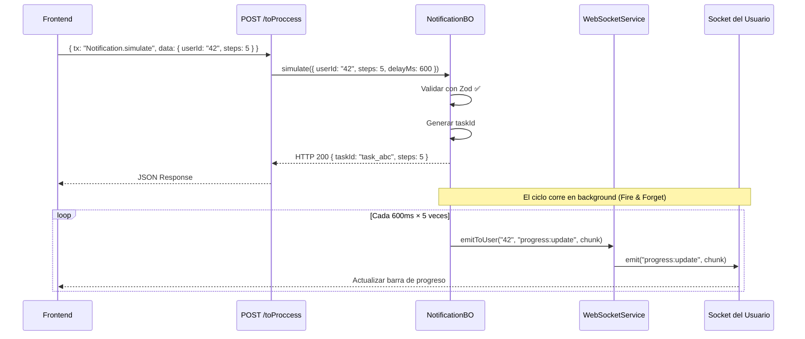

# NotificationBO — Patrón Fire & Forget y Simulación de Progreso

> **Archivo:** `BO/Notification/NotificationBO.ts`
> **Responsabilidad:** BO de prueba que demuestra cómo integrar el `IWebSocketService` en un Business Object usando el patrón Fire & Forget y la simulación de progreso en tiempo real.

---

## Tabla de Contenidos

1. [Estructura del BO](#1-estructura-del-bo)
2. [Constructor y Resolución de Dependencias](#2-constructor-y-resolución-de-dependencias)
3. [Patrón Fire & Forget](#3-patrón-fire--forget)
4. [Método send()](#4-método-send)
5. [Método broadcast()](#5-método-broadcast)
6. [Método simulate() — Chunks de Progreso](#6-método-simulate--chunks-de-progreso)
7. [runProgressLoop() — El Ciclo en Background](#7-runprogressloop--el-ciclo-en-background)
8. [Schemas Zod (Validación)](#8-schemas-zod-validación)
9. [Logs de Debug](#9-logs-de-debug)
10. [Diagrama de Flujo](#10-diagrama-de-flujo)

---

## 1. Estructura del BO

```
BO/Notification/
├── NotificationBO.ts          ← Business Object (lógica)
├── NotificationSchemas.ts     ← Validación Zod
├── NotificationMessages.ts    ← Mensajes i18n
├── NotificationModule.ts      ← Barrel + registro IoC
├── NotificationService.ts     ← Service layer (no usado en playground)
├── NotificationRepository.ts  ← Repository (no usado en playground)
├── NotificationQueries.ts     ← SQL queries (no usado en playground)
├── NotificationTypes.ts       ← Tipos TypeScript
└── NotificationErrors.ts      ← Errores customizados
```

Para el playground, solo usamos **BO + Schemas + Messages**. El Service, Repository y Queries existen pero no se invocan porque el BO interactúa directamente con `IWebSocketService`.

---

## 2. Constructor y Resolución de Dependencias

```typescript
export class NotificationBO extends BaseBO {
    private ws: IWebSocketService
    private boLog: ILogger

    constructor(container: IContainer) {
        super(container)
        registerNotification(container)
        this.ws = container.resolve<IWebSocketService>('websocket')
        this.boLog = this.log.child({ bo: 'NotificationBO' })
    }
```

### Línea por línea:

| Línea                                               | Qué hace                                                                                        |
| --------------------------------------------------- | ----------------------------------------------------------------------------------------------- |
| `super(container)`                                  | Inicializa `BaseBO` que provee `this.db`, `this.log`, `this.config`, `this.i18n`, `this.exec()` |
| `registerNotification(container)`                   | Registra Service y Repository en el contenedor (idempotente, verifica `container.has()`)        |
| `container.resolve<IWebSocketService>('websocket')` | Obtiene el servicio WebSocket del contenedor IoC                                                |
| `this.log.child({ bo: 'NotificationBO' })`          | Crea un sub-logger con contexto `bo: "NotificationBO"` para identificar los logs                |

### ¿Por qué un `boLog` separado?

Porque `this.log` (de BaseBO) ya tiene su propia categoría. Al crear un `child()` con `{ bo: 'NotificationBO' }`, cada log del BO se ve así en la consola:

```
debug [WebSocket] [NotificationBO] emitToUser { userId: "42", event: "notification:send" }
```

Esto facilita filtrar logs en producción.

---

## 3. Patrón Fire & Forget

### ¿Qué es Fire & Forget?

Es un patrón donde **envías algo y no esperas respuesta**. En el contexto de WebSocket:

```typescript
// ❌ MAL — esperar la emisión bloquea la respuesta HTTP
await this.ws.emitToUser(userId, event, payload)

// ✅ BIEN — Fire & Forget, no bloquea
this.ws.emitToUser(userId, event, payload)
```

**¿Por qué no usar `await`?**

1. **`emitToUser()` retorna `void`**, no una Promise.
2. La emisión es **best-effort**: si el usuario no está conectado, el mensaje se pierde (no se encola).
3. El HTTP response al cliente no debe depender de si el WebSocket logró entregar.

**Resultado:** La respuesta HTTP llega en ~5ms mientras que el WebSocket emite en paralelo.

---

## 4. Método send()

```typescript
async send(params: Inputs.SendInput): Promise<ApiResponse> {
    return this.exec<Inputs.SendInput, any>(
        params,
        NotificationSchemas.send,
        async (data) => {
            this.boLog.debug('emitToUser', { userId: data.userId, event: data.event })

            this.ws.emitToUser(data.userId, data.event, {
                message: data.message,
                timestamp: new Date().toISOString(),
            })

            return this.success(
                { sent: true, userId: data.userId, event: data.event },
                this.notificationMessages.send
            )
        }
    )
}
```

### Desglose de `this.exec()`:

`exec()` es un método de `BaseBO` que maneja el ciclo completo:

1. **Valida** `params` contra `NotificationSchemas.send` (Zod).
2. Si la validación falla → retorna automáticamente un error 400 con los detalles.
3. Si pasa → ejecuta el callback (nuestro `async (data) => { ... }`).
4. Captura excepciones y retorna error 500 si algo falla.

### En el callback:

1. **`this.boLog.debug(...)`** — Log de debug para ver en la consola del servidor.
2. **`this.ws.emitToUser(...)`** — Fire & Forget: emite a la sala `user_{userId}`.
3. **`this.success(...)`** — Retorna HTTP 200 inmediatamente.

> **El cliente HTTP recibe la respuesta antes de que el WebSocket entregue el mensaje.** Esto es el patrón Fire & Forget en acción.

---

## 5. Método broadcast()

```typescript
async broadcast(params: Inputs.BroadcastInput): Promise<ApiResponse> {
    return this.exec<Inputs.BroadcastInput, any>(
        params,
        NotificationSchemas.broadcast,
        async (data) => {
            this.boLog.debug('broadcast', { event: data.event })

            this.ws.broadcast(data.event, {
                message: data.message,
                timestamp: new Date().toISOString(),
            })

            return this.success(
                { broadcasted: true, event: data.event },
                this.notificationMessages.broadcast
            )
        }
    )
}
```

Idéntico a `send()` pero usa `ws.broadcast()` (sin sala específica = todos los clientes).

---

## 6. Método simulate() — Chunks de Progreso

```typescript
async simulate(params: Inputs.SimulateInput): Promise<ApiResponse> {
    return this.exec<Inputs.SimulateInput, any>(
        params,
        NotificationSchemas.simulate,
        async (data) => {
            const { userId, steps, delayMs } = data
            const taskId = `task_${Date.now()}`

            this.boLog.debug('simulate started', { userId, steps, delayMs, taskId })

            const labels = [
                'Inicializando entorno…',
                'Conectando a servicios externos…',
                // ... 20 labels en total
            ]

            // Fire & Forget — el ciclo corre en background
            this.runProgressLoop(userId, taskId, steps, delayMs, labels)

            return this.success(
                { taskId, steps, delayMs, userId },
                this.notificationMessages.simulate
            )
        }
    )
}
```

### ¿Qué hace exactamente?

1. **Genera un `taskId` único** basado en timestamp.
2. **Loguea el inicio** con todos los parámetros.
3. **Lanza `runProgressLoop()`** — Este es el ciclo que emitirá los chunks. **NO usa `await`** (Fire & Forget).
4. **Retorna HTTP 200 inmediatamente** con el `taskId` para que el cliente sepa qué tarea monitorear.

### Esquema Zod:

```typescript
simulate: z.object({
    userId: z.string().min(1, validation.requiredField),
    steps: z.number().int().min(3).max(20).default(8),
    delayMs: z.number().int().min(200).max(5000).default(600),
})
```

| Campo     | Tipo   | Rango      | Default | Propósito                     |
| --------- | ------ | ---------- | ------- | ----------------------------- |
| `userId`  | string | min 1 char | —       | A quién enviar los chunks     |
| `steps`   | int    | 3-20       | 8       | Cuántos chunks enviar         |
| `delayMs` | int    | 200-5000   | 600     | Milisegundos entre cada chunk |

---

## 7. runProgressLoop() — El Ciclo en Background

```typescript
private runProgressLoop(
    userId: string,
    taskId: string,
    steps: number,
    delayMs: number,
    labels: string[]
): void {
    let current = 0

    const interval = setInterval(() => {
        current++
        const percent = Math.round((current / steps) * 100)
        const label = labels[(current - 1) % labels.length]
        const status = current >= steps ? 'completed' : 'in_progress'

        this.boLog.debug('chunk emitted', {
            taskId, step: current, totalSteps: steps, percent, label,
        })

        this.ws.emitToUser(userId, 'progress:update', {
            taskId,
            step: current,
            totalSteps: steps,
            percent,
            label,
            status,
            timestamp: new Date().toISOString(),
        })

        if (current >= steps) {
            clearInterval(interval)
            this.boLog.debug('simulate complete', { taskId })
        }
    }, delayMs)
}
```

### Línea por línea:

| Línea                                            | Qué hace                                                                   |
| ------------------------------------------------ | -------------------------------------------------------------------------- |
| `let current = 0`                                | Contador de pasos (closure — vive entre iteraciones del interval)          |
| `setInterval(() => { ... }, delayMs)`            | Ejecuta el callback cada `delayMs` milisegundos                            |
| `current++`                                      | Incrementa el paso actual                                                  |
| `Math.round((current / steps) * 100)`            | Calcula el porcentaje: paso 3 de 8 = 38%                                   |
| `labels[(current - 1) % labels.length]`          | Selecciona el label con operador módulo (rota si hay más pasos que labels) |
| `current >= steps ? 'completed' : 'in_progress'` | El último paso marca el status como completado                             |
| `this.ws.emitToUser(...)`                        | Envía el chunk al usuario via WebSocket                                    |
| `clearInterval(interval)`                        | Detiene el ciclo cuando llega al último paso                               |

### Payload de cada chunk:

```json
{
    "taskId": "task_1708372800000",
    "step": 3,
    "totalSteps": 8,
    "percent": 38,
    "label": "Cargando dependencias…",
    "status": "in_progress",
    "timestamp": "2026-02-19T20:00:00.000Z"
}
```

### Ejemplo con 5 pasos y 500ms de delay:

```
t=0ms    → HTTP 200 (respuesta inmediata)
t=500ms  → chunk 1/5, 20%, "Inicializando entorno…"
t=1000ms → chunk 2/5, 40%, "Conectando a servicios externos…"
t=1500ms → chunk 3/5, 60%, "Cargando dependencias…"
t=2000ms → chunk 4/5, 80%, "Validando configuración…"
t=2500ms → chunk 5/5, 100%, "Procesando datos de entrada…" (completed)
```

---

## 8. Schemas Zod (Validación)

```typescript
// NotificationSchemas.ts
export const createNotificationSchemas = (messages) => {
    const validation = messages.validation

    return {
        send: z.object({
            userId: z.string().min(1, validation.requiredField),
            event: z.string().min(1, validation.requiredField),
            message: z.string().min(1, validation.requiredField),
        }),
        broadcast: z.object({
            event: z.string().min(1, validation.requiredField),
            message: z.string().min(1, validation.requiredField),
        }),
        simulate: z.object({
            userId: z.string().min(1, validation.requiredField),
            steps: z.number().int().min(3).max(20).default(8),
            delayMs: z.number().int().min(200).max(5000).default(600),
        }),
    }
}
```

Los schemas Zod se pasan a `this.exec()` que los usa para validar automáticamente. Si el body no cumple, el BO retorna un 400 sin llegar al callback.

---

## 9. Logs de Debug

Cada método del BO loguea con `this.boLog.debug()`:

| Método              | Log                                                          | Cuándo                   |
| ------------------- | ------------------------------------------------------------ | ------------------------ |
| `send()`            | `emitToUser { userId, event }`                               | Al emitir a un usuario   |
| `broadcast()`       | `broadcast { event }`                                        | Al hacer broadcast       |
| `simulate()`        | `simulate started { userId, steps, delayMs, taskId }`        | Al iniciar la simulación |
| `runProgressLoop()` | `chunk emitted { taskId, step, totalSteps, percent, label }` | En cada chunk            |
| `runProgressLoop()` | `simulate complete { taskId }`                               | Al terminar              |

Para ver estos logs, ejecuta el backend con:

```bash
LOG_LEVEL=debug pnpm run dev
```

---

## 10. Diagrama de Flujo


